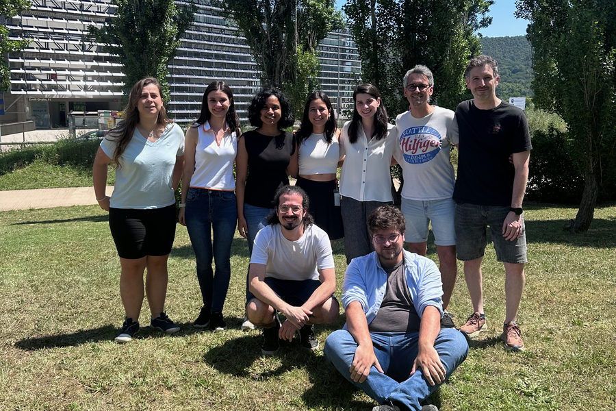
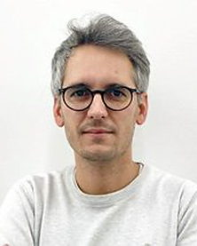
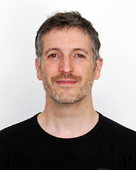
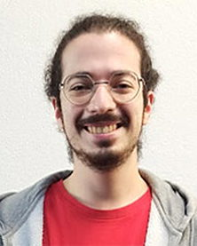
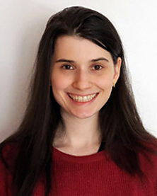
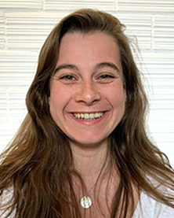
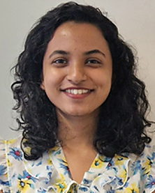
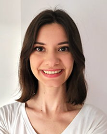
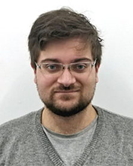
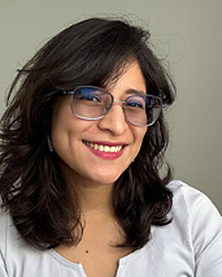

<!-- GENERATED by scripts/build_team.py from data/team.yml.
     Hand edits will be overwritten. -->

```{=html}
<figure class="cbc-groupphoto"></figure>
```

## Principal investigators

```{=html}
<div class="cbc-pi-pair-full"><div class="cbc-pi-card"><div class="cbc-pi-detail"><h3 class="cbc-person-name">Marc Garcia-Borràs</h3><p class="cbc-person-role">ICREA Research Professor at IQCC, Universitat de Girona</p><p class="cbc-person-bio">PhD in Chemistry from the Universitat de Girona (2015), with Miquel Solà and Josep M. Luis. Postdoctoral researcher with K. N. Houk at UCLA (2016–2019). Returned to the UdG as a Beatriu de Pinós researcher, and subsequently a Ramón y Cajal Fellow at IQCC from 2022 to 2026.</p><p class="cbc-person-sub">Research interests</p><ul class="cbc-person-list"><li>Reactive intermediates in biocatalysis</li><li>Computationally-guided enzyme design</li><li>Carbene and nitrene transferases</li><li>Nonheme iron enzymes</li><li>Abiological radical chemistry</li></ul><p class="cbc-person-contact"><a href="mailto:marc.garcia@udg.edu">marc.garcia@udg.edu</a> <a href="https://orcid.org/0000-0001-9458-1114">ORCID</a> <a href="https://scholar.google.com/citations?user=IKCfbg0AAAAJ&amp;hl=es">Google Scholar</a></p></div></div><div class="cbc-pi-card"><div class="cbc-pi-detail"><h3 class="cbc-person-name">Ferran Feixas</h3><p class="cbc-person-role">Associate Professor at IQCC, Universitat de Girona</p><p class="cbc-person-bio">PhD in Chemistry from the Universitat de Girona (2011), with Miquel Solà, Jordi Poater and Eduard Matito. Postdoctoral researcher with J. Andrew McCammon at UC San Diego (2012–2014). Returned to the UdG as a Marie Skłodowska-Curie Individual Fellow, and then a Ramón y Cajal Researcher from 2022 to 2026.</p><p class="cbc-person-sub">Research interests</p><ul class="cbc-person-list"><li>Molecular dynamics and enhanced sampling</li><li>Protein allostery and conformational dynamics</li><li>Ligand binding pathways</li><li>Supramolecular host–guest dynamics</li><li>Mechanism-guided drug design</li></ul><p class="cbc-person-contact"><a href="mailto:ferran.feixas@udg.edu">ferran.feixas@udg.edu</a> <a href="https://orcid.org/0000-0001-5147-0000">ORCID</a> <a href="https://scholar.google.com/citations?user=xuc_XiYAAAAJ&amp;hl=en">Google Scholar</a> <a href="https://ferranfeixas.github.io">Personal site</a></p></div></div></div>
```

## Researchers and students

```{=html}
<ul class="cbc-members"><li class="cbc-member"><div class="cbc-member-detail"><span class="cbc-person-name">Daniel Bosch Coch</span><span class="cbc-person-role">Postdoctoral researcher</span><span class="cbc-member-topic">AI and automatisation protocols applied to biocatalysis</span></div></li><li class="cbc-member"><div class="cbc-member-detail"><span class="cbc-person-name">Helena Giramé</span><span class="cbc-person-role">PhD student</span><span class="cbc-member-topic">Integrative computational modeling of biochemical and biocatalytic processes</span><span class="cbc-member-funding">FI-GenCat fellowship, 2022–2026</span></div></li><li class="cbc-member"><div class="cbc-member-detail"><span class="cbc-person-name">Cristina Berga</span><span class="cbc-person-role">PhD student</span><span class="cbc-member-topic">Integrative computational modeling of dynamic effects on catalysis</span><span class="cbc-member-funding">IF-UdG fellowship, 2023–2027</span></div></li><li class="cbc-member"><div class="cbc-member-detail"><span class="cbc-person-name">Aqza Elsa John</span><span class="cbc-person-role">PhD student</span><span class="cbc-member-topic">Computational modeling of electrostatic confinement in biocatalysis</span><span class="cbc-member-funding">FPI fellowship, 2024–2028</span></div></li><li class="cbc-member"><div class="cbc-member-detail"><span class="cbc-person-name">Hande Abeş</span><span class="cbc-person-role">PhD student</span><span class="cbc-member-topic">Bridging scales in the computational modeling of biochemical and biocatalytic processes</span><span class="cbc-member-funding">FI-GenCat fellowship, 2024–2028</span></div></li><li class="cbc-member"><div class="cbc-member-detail"><span class="cbc-person-name">Raúl Lago Saavedra</span><span class="cbc-person-role">PhD student</span><span class="cbc-member-topic">Towards the computational reconstruction of the time-evolution of biomolecular processes</span><span class="cbc-member-funding">IF-UdG fellowship, 2024–2028</span></div></li><li class="cbc-member"><div class="cbc-member-detail"><span class="cbc-person-name">Itzel Muro Puente</span><span class="cbc-person-role">PhD student</span><span class="cbc-member-note">Co-supervised together with Juan Vicente Alegre-Requena (CSIC)</span><span class="cbc-member-topic">AI and automatisation protocols applied to biocatalysis</span><span class="cbc-member-funding">MOMENTUM-CSIC fellowship, 2026–2029</span></div></li></ul>
```

## Alumni

```{=html}
<ul class="cbc-alumni"><li class="cbc-alumnus"><span class="cbc-person-name">Dr. Jordi Soler</span><span class="cbc-member-topic">Ramón Areces Postdoctoral Researcher at the University of Oxford, in Prof. Fernanda Duarte's group</span></li><li class="cbc-alumnus"><span class="cbc-person-name">Dr. Carla Calvó-Tusell</span><span class="cbc-member-funding">Postdoctoral researcher in the group until 2023</span><span class="cbc-member-topic">Schmidt AI in Science Postdoctoral Fellow at UC San Diego, in Prof. Rommie Amaro's group</span></li></ul>
```

::: {.cbc-todo}
No email addresses were supplied for the postdoctoral researcher or the PhD students. The brief's team specification asks for them; they are not shown rather than guessed from an address pattern. Add an `email:` line to any entry in data/team.yml and it will appear.
:::
