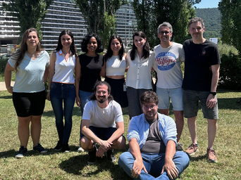

<!-- The page's <h1> comes from the `title` above, via Quarto's title block.
     The four blocks below are placed by CSS grid (see custom.scss), which is
     what lets the running order differ between desktop and mobile. -->

::: {.cbc-identity}

::: {.cbc-fullname}
Computational Biochemistry and Biocatalysis
:::

::: {.cbc-affil}
Institute of Computational Chemistry and Catalysis (IQCC) and Department of
Chemistry, Universitat de Girona, Girona, Catalonia, Spain
:::

:::

::: {.cbc-lead}
We combine quantum chemistry, molecular dynamics and enhanced sampling to
understand how biochemical and biocatalytic processes actually happen — and use
that mechanistic understanding to design new enzymes, drugs and supramolecular
systems.
:::

::: {.cbc-news-block}

```{=html}
<div class="cbc-news-head">
  <h2>News</h2>
  <a class="cbc-news-all" href="news.html">All news</a>
</div>
```

::: {#home-news}
:::

:::

::: {.cbc-home-side}

{.cbc-side-photo fig-alt="The CompBioCat group on the Montilivi campus, Universitat de Girona."}

::: {.cbc-pis-block}

::: {.cbc-side-label}
Principal investigators
:::

::: {.cbc-pis}

::: {.cbc-pi}
::: {.cbc-pi-name}
Marc Garcia-Borràs
:::
::: {.cbc-pi-role}
ICREA Research Professor at IQCC, Universitat de Girona
:::
::: {.cbc-pi-mail}
[marc.garcia@udg.edu](mailto:marc.garcia@udg.edu)
:::
:::

::: {.cbc-pi}
::: {.cbc-pi-name}
Ferran Feixas
:::
::: {.cbc-pi-role}
Associate Professor at IQCC, Universitat de Girona
:::
::: {.cbc-pi-mail}
[ferran.feixas@udg.edu](mailto:ferran.feixas@udg.edu)
:::
:::

:::

:::



:::
